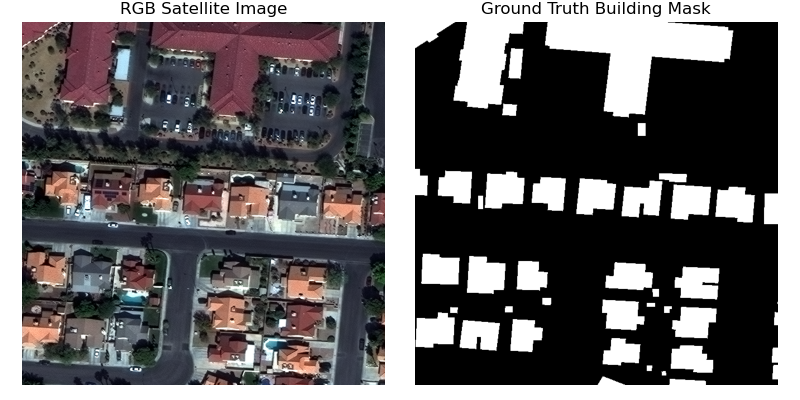

# Fine-tune SAM (Segment Anything Model) using Distributed Training on Amazon SageMaker

This code sampes explores how to fine-tune [Segment Anything Model (SAM)](https://segment-anything.com/), a state-of-the-art promptable vision model for your specialized image segmemtation use case. SAM is an open-source transformer-based vision model which excells in zero-shot object segmentation from images. It is available in three different sizes (base, large, huge) on the HuggingFace Hub. We demonstrate how you can leverage SAM's general notion of what objects are in an image for your own specialized object segmentation use cases. Specifically, this tutorial guides you through the process of fine-tuning the SAM base architecture on labeled satellite imagery to segment building footprints. Scripts have been optimized for distributed training using Amazon SageMaker Training Jobs (using the `PyTorch()` estimator class) and the PyTorch distributed data parallel (DDP) wrapper. 

## Background

### Why fine-tune a pre-trained vision foundation model?

Vision Transformer (ViT)-based foundation models (FMs) are large, general-purpose computer vision models that have been pre-trained on vast amounts of image data in a porcess called [self-supervised learning](https://en.wikipedia.org/wiki/Self-supervised_learning). During the training process, input images are divided into equally sized patches and a certain portion of patches is masked (i.e., withheld) from the model. The core training objective is for the ViT to fill in the missing patches, effectively re-creating the original image. Note that this process does not typically required labelled data.

The key component of interest resulting from this pre-training process is the Vision Encoder which has learned to produce embeddings that represent any given input image in lower dimensional space without significant loss of information. Fine-tuning leverages this capability by training (or adapting) a specialized decoder that sits on top of the pre-trained ViT and takes the embeddings generated by the encoder as input. This has several advantages, compared to training a dedicated model from scratch. First, the process usually requires less labeled data. Second, the decoder is typically lightweight and can often be trained on a single GPU. Third, the new model takes advantage of the representation capabilities of the pre-trained image encoder, re-using it for multiple downstream tasks.

### SAM Model Architecture
The Segment Anayting Model (SAM) is made up of 3 main modules:
* The VisionEncoder: a VIT based image encoder. It computes the image embeddings using attention on patches of the image. Relative Positional Embedding is used. SAM leverages a pre-trained vision encoder trained using masked auto-encoding (MAE).
* The PromptEncoder: generates embeddings for points, bounding boxes, and/or text prompts. Here we will use only bounding boxes as prompts.
* The MaskDecoder: a two-ways transformer which performs cross attention between the image embedding and the prompt embeddings (->) and between the prompt embeddings and the image embeddings.

Fine-tuning focuses on the __MaskDecoder__. All other weights are frozen.

	
	<em> Detailed architecture of Segment Anything Model (SAM).</em>

There is also a fourth component (sometimes called the neck), which is represented as a convolutional layer taking a segmentation mask as input. This component can be optionally used to submit a previously generated mask as context whenever users interact with SAM over multiple iterations (e.g., re-drawing bounding boxes, etc.). We will not use this option here.

## Architecture & Solution Overview

Fine-tuning SAM on a custom dataset comprises the following steps:
1. Use a SageMaker Studio Notebook to retrieve and prepare custom data for fine-tuning and save to S3
2. Download SAM model weights from the HuggingFace Hub
3. Run distributed training using a SageMaker Training Job
4. Retrieve fine-tuned model weights and run exemplary inferences on a SageMaker Studio Notebook

### SpaceNet Satellite Imagery as Custom Dataset
SAM was trained on >1bn annotated images (SA-1B Dataset). You can explore the SA-1B Dataset [here](https://segment-anything.com/dataset/index.html). To illustrate the power of fine-tuning we will focus on the case of satellite image segmentation, a class of images that is not represented widely in SA-1B. Specialized image data like satellite imagery represents a good out-of-domain test case to demonstrate the power of fine-tuning a general-purpose vision foundation model like SAM for highly specialized applications and domains.

Specifically, this tutorial uses [SpaceNet data](https://registry.opendata.aws/spacenet/), available on the Amazon Registry of Open Data. This dataset consists of 200mx200m satellite images/labels. 

We will use pre-extracted ~0.3m resolution pan-sharpened RGB (`PS-RGB`) 3-channel satellite images from the city of Las Vegas that have been white-balanced. We have also extracted ground truth masks of buildings as GeoJSON files (`geojson_buildings/` directory). The pre-processed data sample is hosted on a public Amazon S3 bucket: `s3://aws-satellite-lidar-tutorial/data/`. See below for an example of the ground truth data used here: 

### Model Weights on the HuggingFace Hub

The SAM foundation model is available as an open-source implementation under the [Apache 2.0 license](https://choosealicense.com/licenses/apache-2.0/) via the HuggingFace Hub. There are three different versions of SAM available:
* [`sam-vit-base`](https://huggingface.co/facebook/sam-vit-base) (~94M params, 0.3 GB)
* [`sam-vit-large`](https://huggingface.co/facebook/sam-vit-large) (~312M params, 1.25 GB)
* [`sam-vit-huge`](https://huggingface.co/facebook/sam-vit-huge) (~641M params, 2.56 GB)

For illustrative purposes, this example focuses on fine-tuning `sam-vit-large`, although the model type is a parameter that is configurable and you can opt for the smaller (or larger) versions depending on your preferences.

### Distributed Training using an Amazon SageMaker Training Job
Training is fascilitated via a [SageMaker Training Job](https://docs.aws.amazon.com/sagemaker/latest/dg/how-it-works-training.html) and is implemented on top of a managed [PyTorch Estimator](https://sagemaker.readthedocs.io/en/stable/frameworks/pytorch/using_pytorch.html#train-a-model-with-pytorch) that leverages AWS-managed pre-built training Docker image optimized for PyTorch environments.

Note that the SAM model family consist of onyl moderately large model which can fit a single modern GPU's vRAM, provided batch size is not too large. Yet, to speed up training times, especially when training on large datasets, distributing the training load across multiple GPUs may be advisable. In this example we have implemented a Data Parallel strategy using PyTorch's Distributed Data Parallel framework. Adapting a PyTorch training script for DDP is straight forward and detailed [here]().

In addition to distributed training, we have made several additional optimizations. These include:

* **Gradient Accumulation**: Gradient Accumulation helps reduce the memory footprint by achieving the same effective batch size at significantly smaller actual batch sizes. In others words: with a gradient accumulation frequency of 2, you can reduce batch size by a factor of 2 for the same result, hence reducing memory footprint associated with 1/ storing large batches on GPU and 2/ persisting the activations associated with passing larger batches through the network. Note that this can come at a small speed penalty due to more forward and backward passes through the network.
* **Mixed Precision Training (Pytorch AMP)**: Mixed precision training reduces compute and usually memory requirements. It does so by representing some matrices in lower precision (i.e., FP16 at 2 bytes/element, vs. FP32 full precision at 4 bytes/element). The memory savings exclusively originate from reducing the activation footprint. Weights are saved in both full and half precision, optimizer states retain full precision and gradients are re-cast to full precision for the optimization. Mixed Precision will be most effective if the share of activations in the total memory footprint is large (as is the case with large minibatch sizes).

To further reduce memory footprint users may also consider [Gradient Checkpointing](https://github.com/prigoyal/pytorch_memonger/blob/master/tutorial/Checkpointing_for_PyTorch_models.ipynb), which trades memory for compute. Also refer to [this](https://huggingface.co/docs/transformers/v4.20.1/en/perf_train_gpu_one) post for additional details. 

To improve cost performance this sample also implements [managed spot training](https://docs.aws.amazon.com/sagemaker/latest/dg/model-managed-spot-training.html) that makes it easy to train machine learning models using managed Amazon EC2 Spot instances.

### Run Inferences
Below is an example of the fine-tuned model output. The left pane shows the ground truth building masks overlaid on the raw satellite image. The middel pane shows the post processed output from the fine-tuned model (after applying a sigmoid function), the right pane shows the "hard" (i.e., binary) building maks derived from the probability mask (middle pane) by applying simple threshholding (p=0.6 in this case):

## Prerequisites & Deployment

To get started clone this repository to your SageMaker Studio JupyterLab Space and follow the instructions laid out in `01-fine-tune-sam-geospatial.ipynb`. It is recommended to run this notebook on a `ml.g5s.2xlarge` instance. The training job can be run on a `ml.g5.12xlarge` or larger.

## Security

See [CONTRIBUTING](CONTRIBUTING.md#security-issue-notifications) for more information.

## License

This library is licensed under the MIT-0 License. See the LICENSE file.

